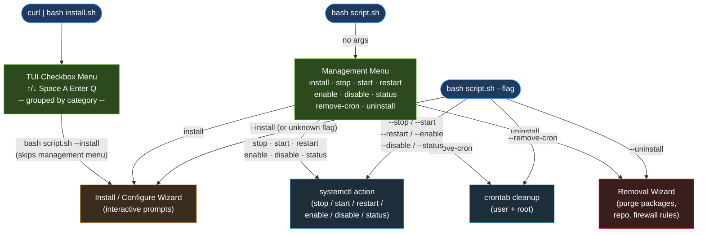

# wanforge/scripts

Interactive Linux server automation toolkit — one launcher, 26 scripts across
8 categories: system setup, security hardening, cloud panels, databases, app
runtimes, monitoring & observability, CI/CD, and network & Proxmox tooling.

Run scripts individually or use `install.sh`, an interactive grouped checkbox
launcher that fetches and runs the chosen scripts in order. No authentication
required — public repo, served via GitHub Pages at `scripts.wanforge.asia`.

Scripts are organized under `script/linux/<category>/`, structured so future
macOS or Windows scripts can be added alongside without changing the layout.

## Requirements

- **OS**: Linux (currently). Scripts live under `script/linux/`; macOS/Windows
  variants would go in `script/macos/` / `script/windows/` when added.
- **Package manager**: `apt`, `dnf`, `yum`, `pacman`, `zypper`, or `apk`.
  Some scripts are Debian/Ubuntu only (noted in the table below).
- **Tools**: `curl` and `sudo` (or root). Node.js, Composer, and PM2 install
  user-local — no `sudo` needed for those.
- **Terminal**: interactive TTY (scripts read input from `/dev/tty`).

### Install `curl` first (fresh systems)

A minimal install may not ship `curl`. Install it for your distro:

```bash
# Debian / Ubuntu
sudo apt update && sudo apt install -y curl

# Fedora / RHEL / CentOS / Rocky / Alma
sudo dnf install -y curl          # or: sudo yum install -y curl

# Arch / Manjaro
sudo pacman -Sy --noconfirm curl

# openSUSE
sudo zypper install -y curl

# Alpine
sudo apk add curl
```

If you are `root` (e.g. a fresh container/VM), drop the `sudo`. No package
manager handy? `curl` usually rides along with `wget` — see the wget alternative
below.

## Run via the Launcher

```bash
curl -fsSL https://scripts.wanforge.asia/install.sh | bash
```

No `curl`? Use `wget` instead (present on many minimal images):

```bash
wget -qO- https://scripts.wanforge.asia/install.sh | bash
```

Menu controls:

| Key       | Action                   |
| --------- | ------------------------ |
| Up / Down | Move between rows        |
| Space     | Toggle a selection       |
| A         | Toggle all               |
| Enter     | Run the selected scripts |
| Q         | Cancel and exit          |

The menu is grouped by category and runs the selected scripts in menu order. If
one fails, the rest still continue. No authentication is needed — this is a
public repository.

**Navigation:** the launcher loops. After the chosen scripts finish you return to
this menu (press Enter), so you can keep picking more. Inside a sub-script's own
menu (firewall / database / CloudPanel / Proxmox / net-tools managers) press `Q`
to go **back to the launcher**. Press `Q` at the launcher to quit entirely.

```text
Select scripts to run:  ↑/↓ move · SPACE toggle · A all · ENTER run · Q quit

── System ──
❯ [ ] install-packages     Update system + base essentials (micro, curl, wget, git)
  [ ] set-timezone         Set timezone (UTC recommended for servers)
  [ ] backup-tools         Backup manager: S3 / FTP / SFTP — named profiles, cron, dry-run
── Security ──
  [ ] install-firewall     Install & configure ufw firewall
  [ ] firewall-manager     Full ufw manager: allow/deny IP/port, multiple, rate-limit
  [ ] install-fail2ban     Install & enable Fail2Ban
  [ ] secure-ssh           Harden SSH: change port, disable root/password, pubkey
  [ ] generate-ssh-key     Generate an ed25519 SSH key (user-local)
  [ ] manage-users         Manage Linux users, sudo access & SSH keys
── Panel & Console ──
  [ ] install-cloudpanel   Install CloudPanel CE v2 (Debian/Ubuntu only)
  [ ] clpctl-manager       Manage CloudPanel via clpctl (sites, db, users, certs)
  [ ] install-cockpit      Install Cockpit web console + modules (Debian/Ubuntu)
── Database ──
  [ ] install-postgresql   Install PostgreSQL + create roles + remote access
  [ ] enable-mysql-remote  Allow remote MySQL/MariaDB access (sensitive)
  [ ] database-toolkit     Monitor, optimize, config, datetime (MySQL/PostgreSQL)
── App Runtime ──
  [ ] install-nodejs       Install Node.js via nvm (user-local) + PM2
  [ ] install-python       Install Python 3 + pip, venv, dev, pipx
  [ ] install-composer     Install Composer (user-local, signature-verified)
  [ ] setup-pm2-app        Configure pm2-logrotate + register an app (ecosystem)
── Monitoring ──
  [ ] monitor-system       CPU, RAM, storage, processes, network (snapshot or realtime)
── Network ──
  [ ] net-tools            Local/public IP, ports, speedtest, ping, dig, scan
── Proxmox ──
  [ ] proxmox-toolkit      PVE: node/VM/CT resources, storage, realtime dashboard
── CI/CD ──
  [ ] install-github-runner GitHub Actions self-hosted runner (avoid billed minutes)
── Observability ──
  [ ] install-prometheus   Prometheus + node_exporter (+ Alertmanager)
  [ ] install-grafana      Grafana + Prometheus data source
  [ ] install-zabbix       Zabbix agent or server (official repo)
```

### Launcher Flow



> **Service scripts** (fail2ban, grafana, prometheus, zabbix, cockpit, postgresql) use `systemctl`
> for stop/start/restart/enable/disable/status.
> **backup-tools** and **setup-pm2-app** have their own action sets (backup engine / pm2 commands).
> **Non-service scripts** (nodejs, composer, python, ssh-key) only expose install + uninstall.

## Output Modes

Every script shares one verbosity control (defined in `lib.sh`). Set it with an
environment variable (recommended — it also propagates through the launcher) or
a flag:

| Mode      | Shows                                   | How                                  |
| --------- | --------------------------------------- | ------------------------------------ |
| `silent`  | Errors and final result only, no banner | `MODE=silent` · `QUIET=1` · `-q`     |
| `normal`  | Banner + info/ok/warn/err (default)     | `MODE=normal` (default)              |
| `verbose` | Normal + extra `dbg` detail             | `MODE=verbose` · `VERBOSE=1` · `-v`  |
| `debug`   | Verbose + shell trace (`set -x`)        | `MODE=debug` · `DEBUG=1` · `--debug` |

```bash
# silent (good for automation / cron)
curl -fsSL https://scripts.wanforge.asia/install.sh | MODE=silent bash

# verbose
curl -fsSL .../script/linux/monitoring/monitor-system.sh | VERBOSE=1 bash
```

### Dry-run (all scripts)

`DRY_RUN=1` (or `--dry-run` / `-n`) makes every script **print** the
state-changing commands instead of running them — defined once in `lib.sh`, so
it works the same everywhere:

```bash
curl -fsSL .../script/linux/security/install-fail2ban.sh | DRY_RUN=1 bash
# →  [dry-run] sudo apt-get install -y fail2ban
#    [dry-run] sudo systemctl start fail2ban
```

Dry-run covers system mutations: package managers (install/upgrade/remove),
services (`systemctl`/`rc-service`), `ufw`, `sed -i`, `tee` config writes,
`timedatectl`, file ops, and PostgreSQL `VACUUM`/`REINDEX`. Read-only commands
still run so you see real state. A few user-local installs (nvm/Node, Composer,
PM2) and MySQL client mutations execute as normal.

### Automation & logging

| Variable / flag                 | Effect                                                               |
| ------------------------------- | -------------------------------------------------------------------- |
| `ASSUME_YES=1` · `YES=1` · `-y` | `ask` returns the default answer without prompting (non-interactive) |
| `LOG_FILE=/path`                | Appends a plain-text (no-color) copy of every log line               |
| `NO_COLOR=1`                    | Disables colors in any mode                                          |

```bash
# fully unattended, dry-run, logged
curl -fsSL .../script/linux/security/install-fail2ban.sh | ASSUME_YES=1 DRY_RUN=1 LOG_FILE=/var/log/wf.log bash
```

Note: `ASSUME_YES` only fills prompts that have a safe default; password prompts
and free-text inputs (e.g. role names) still need real input or are skipped.

### Target user (install for a CloudPanel / site user)

The user-local scripts (`install-nodejs`, `install-composer`, `setup-pm2-app`)
install into a user's home — not the system. When you run them as **root**, they
ask which user to install for (or set `TARGET_USER=<name>` / `--user=<name>`) and
re-run themselves as that user via `sudo -u`, so Node/Composer/PM2 land in that
user's home. Perfect for CloudPanel site users:

```bash
# install Node + PM2 into the CloudPanel site user 'john'
curl -fsSL .../script/linux/runtime/install-nodejs.sh | TARGET_USER=john bash
```

All menus (launcher and the `clpctl` / database / firewall managers) are
arrow-key TUIs — `↑/↓` to move, `ENTER` to select, `Q` to go back.

### Uninstall / rollback

Install scripts support sub-commands for granular lifecycle control.
Download the script first (pipe discards `$1`), then run with a flag:

```bash
curl -fsSL .../install-grafana.sh -o install-grafana.sh
bash install-grafana.sh --stop        # stop service only
bash install-grafana.sh --disable     # stop + disable autostart
bash install-grafana.sh --enable      # enable + start
bash install-grafana.sh --restart     # restart
bash install-grafana.sh --status      # systemctl status (no-pager)
bash install-grafana.sh --remove-cron # remove related cron entries
bash install-grafana.sh --uninstall   # full removal (packages, repo, firewall rules)
```

**Available flags per script:**

| Script                        |                   stop                   |   start    | restart |   enable   |   disable   | status | remove-cron |     uninstall      |
| ----------------------------- | :--------------------------------------: | :--------: | :-----: | :--------: | :---------: | :----: | :---------: | :----------------: |
| `install-fail2ban.sh`         |                    ✓                     |     ✓      |    ✓    |     ✓      |      ✓      |   ✓    |      ✓      |         ✓          |
| `install-grafana.sh`          |                    ✓                     |     ✓      |    ✓    |     ✓      |      ✓      |   ✓    |      ✓      |         ✓          |
| `install-prometheus.sh`       |                    ✓                     |     ✓      |    ✓    |     ✓      |      ✓      |   ✓    |      ✓      |         ✓          |
| `install-zabbix.sh`           |                    ✓                     |     ✓      |    ✓    |     ✓      |      ✓      |   ✓    |      ✓      |         ✓          |
| `install-cockpit.sh`          |                    ✓                     |     ✓      |    ✓    |     ✓      |      ✓      |   ✓    |      ✓      |         ✓          |
| `install-postgresql.sh`       |                    ✓                     |     ✓      |    ✓    |     ✓      |      ✓      |   ✓    |      ✓      |        ✓ ⚠         |
| `install-firewall.sh`         |               `--disable`                | `--enable` |    —    | `--enable` | `--disable` |   ✓    |      ✓      |         ✓          |
| `install-firewall.sh` (extra) | `--reload` · `--reset` (wipes all rules) |            |         |            |             |        |             |                    |
| `setup-pm2-app.sh`            |                    ✓                     |     ✓      |    ✓    |     —      |      —      |   ✓    |      ✓      |         ✓          |
| `setup-pm2-app.sh` (extra)    |         `--logs` (tail app logs)         |            |         |            |             |        |             |                    |
| `install-nodejs.sh`           |                    —                     |     —      |    —    |     —      |      —      |   —    |      ✓      |         ✓          |
| `install-composer.sh`         |                    —                     |     —      |    —    |     —      |      —      |   —    |      —      |         ✓          |
| `install-python.sh`           |                    —                     |     —      |    —    |     —      |      —      |   —    |      —      |         ✓          |
| `enable-mysql-remote.sh`      |                    —                     |     —      |    —    |     —      |      —      |   —    |      —      |    ✓ (rollback)    |
| `secure-ssh.sh`               |                    —                     |     —      |    —    |     —      |      —      |   —    |      —      | ✓ (restore backup) |
| `generate-ssh-key.sh`         |                    —                     |     —      |    —    |     —      |      —      |   —    |      —      |         ✓          |
| `install-cloudpanel.sh`       |                    —                     |     —      |    —    |     —      |      —      |   —    |      —      |  ✓ (manual steps)  |

Service scripts (`--stop/start/restart/enable/disable/status`) use `systemctl` and
operate on all services the script manages (e.g. prometheus also controls
`prometheus-node-exporter` and `prometheus-alertmanager`).

`--remove-cron` scans both the current user's and root's crontab for entries
matching the service name and removes them.

> **PostgreSQL `--uninstall`:** prompts twice — once for package removal, once for
> `/var/lib/postgresql` data deletion. Answer carefully.

## Run a Single Script

Each script can also be run directly without the launcher.

```bash
# System
curl -fsSL https://scripts.wanforge.asia/script/linux/system/install-packages.sh | bash
curl -fsSL https://scripts.wanforge.asia/script/linux/system/set-timezone.sh | bash
curl -fsSL https://scripts.wanforge.asia/script/linux/system/install-firewall.sh | bash
curl -fsSL https://scripts.wanforge.asia/script/linux/system/backup-tools.sh | bash

# Security
curl -fsSL https://scripts.wanforge.asia/script/linux/security/firewall-manager.sh | bash
curl -fsSL https://scripts.wanforge.asia/script/linux/security/install-fail2ban.sh | bash
curl -fsSL https://scripts.wanforge.asia/script/linux/security/secure-ssh.sh | bash
curl -fsSL https://scripts.wanforge.asia/script/linux/security/generate-ssh-key.sh | bash
curl -fsSL https://scripts.wanforge.asia/script/linux/security/manage-users.sh | bash

# Panels & consoles
curl -fsSL https://scripts.wanforge.asia/script/linux/cloud/install-cloudpanel.sh | bash
curl -fsSL https://scripts.wanforge.asia/script/linux/cloud/clpctl-manager.sh | bash
curl -fsSL https://scripts.wanforge.asia/script/linux/cloud/install-cockpit.sh | bash

# Databases
curl -fsSL https://scripts.wanforge.asia/script/linux/database/install-postgresql.sh | bash
curl -fsSL https://scripts.wanforge.asia/script/linux/database/enable-mysql-remote.sh | bash
curl -fsSL https://scripts.wanforge.asia/script/linux/database/database-toolkit.sh | bash

# Monitoring & network
curl -fsSL https://scripts.wanforge.asia/script/linux/monitoring/monitor-system.sh | bash
curl -fsSL https://scripts.wanforge.asia/script/linux/network/net-tools.sh | bash

# Proxmox (run on a PVE node)
curl -fsSL https://scripts.wanforge.asia/script/linux/network/proxmox-toolkit.sh | bash

# CI/CD
curl -fsSL https://scripts.wanforge.asia/script/linux/cicd/install-github-runner.sh | bash

# Observability stack
curl -fsSL https://scripts.wanforge.asia/script/linux/monitoring/install-prometheus.sh | bash
curl -fsSL https://scripts.wanforge.asia/script/linux/monitoring/install-grafana.sh | bash
curl -fsSL https://scripts.wanforge.asia/script/linux/monitoring/install-zabbix.sh | bash

# App runtime
curl -fsSL https://scripts.wanforge.asia/script/linux/runtime/install-nodejs.sh | bash
curl -fsSL https://scripts.wanforge.asia/script/linux/runtime/install-python.sh | bash
curl -fsSL https://scripts.wanforge.asia/script/linux/runtime/install-composer.sh | bash
curl -fsSL https://scripts.wanforge.asia/script/linux/runtime/setup-pm2-app.sh | bash
```

## Scripts Overview

| Group           | Script                     | Purpose                                                                       | Sudo | Distro          |
| --------------- | -------------------------- | ----------------------------------------------------------------------------- | ---- | --------------- |
| —               | `install.sh`               | Grouped checkbox launcher that runs the other scripts                         | —    | Any             |
| System          | `install-packages.sh`      | Update/upgrade system, install base essentials (micro/curl/wget/git)          | Yes  | Multi           |
| System          | `set-timezone.sh`          | Set timezone via `timedatectl` (default `Asia/Jakarta`)                       | Yes  | Any (systemd)   |
| System          | `backup-tools.sh`          | Backup manager: S3 / FTP / SFTP — named profiles, cron, dry-run               | No   | Any             |
| System          | `install-firewall.sh`      | Install `ufw`, open SSH/http/https, add custom ports, enable                  | Yes  | Mainly Deb/Ubu  |
| Security        | `firewall-manager.sh`      | Full ufw manager: allow/deny IP & port, multi-IP, rate-limit                  | Yes  | Any (ufw)       |
| Security        | `install-fail2ban.sh`      | Install and enable the Fail2Ban service                                       | Yes  | Multi           |
| Security        | `secure-ssh.sh`            | Change SSH port, disable root/password login, enable pubkey                   | Yes  | Any (OpenSSH)   |
| Security        | `manage-users.sh`          | Manage Linux users, sudo access, passwords, shells, and SSH keys              | Yes  | Any             |
| Security        | `generate-ssh-key.sh`      | Generate an ed25519 SSH key, fix perms, print public key                      | No   | Any             |
| Panel & Console | `install-cloudpanel.sh`    | Install CloudPanel CE v2, choose DB engine, verify checksum                   | Yes  | Debian/Ubuntu   |
| Panel & Console | `clpctl-manager.sh`        | Manage CloudPanel via `clpctl`: sites, db, users, certs, vhosts               | Yes  | CloudPanel      |
| Panel & Console | `install-cockpit.sh`       | Install Cockpit + modules, reverse-proxy config, open port 9090               | Yes  | Debian/Ubuntu   |
| Database        | `install-postgresql.sh`    | Install latest PostgreSQL (PGDG), create roles, remote access                 | Yes  | Debian/Ubuntu   |
| Database        | `enable-mysql-remote.sh`   | Remote MySQL/MariaDB: bind-address, firewall, create users                    | Yes  | Debian/Ubuntu   |
| Database        | `database-toolkit.sh`      | Monitor / optimize / config / datetime — MySQL & PostgreSQL                   | Yes  | Any (DB client) |
| App Runtime     | `install-nodejs.sh`        | Install Node.js via nvm (user-local), choose version, PM2                     | No   | Any             |
| App Runtime     | `install-python.sh`        | Python 3 + pip, venv/virtualenv, dev headers, pipx (multi-distro)             | Yes  | Multi           |
| App Runtime     | `install-composer.sh`      | Install Composer to `~/.local/bin`, verify signature                          | No   | Any (needs PHP) |
| App Runtime     | `setup-pm2-app.sh`         | Configure pm2-logrotate + register an app (ecosystem.config.js)               | No   | Any             |
| Monitoring      | `monitor-system.sh`        | CPU/RAM/storage/processes/network — snapshot or realtime watch                | Some | Any             |
| Network         | `net-tools.sh`             | Local/public IP, ports, speedtest, ping/traceroute/dig/whois/scan             | Some | Any             |
| Proxmox         | `proxmox-toolkit.sh`       | PVE node/VM/CT resources, storage, cluster, realtime dashboard                | Yes  | Proxmox VE      |
| CI/CD           | `install-github-runner.sh` | GitHub Actions self-hosted runner as a systemd service (avoid billed minutes) | Yes  | Linux           |
| Observability   | `install-prometheus.sh`    | Prometheus + node_exporter + optional Alertmanager, scrape config             | Yes  | Debian/Ubuntu   |
| Observability   | `install-grafana.sh`       | Grafana (official repo) + auto Prometheus data source                         | Yes  | Debian/Ubuntu   |
| Observability   | `install-zabbix.sh`        | Zabbix agent or full server (frontend + MySQL schema)                         | Yes  | Debian/Ubuntu   |

## Script Details

### install-packages.sh

- Detects the package manager: `apt`, `dnf`, `yum`, `pacman`, `zypper`, `apk`.
- **Grouped checkbox menu** (default all on, uncheck to skip): System actions
  (update / upgrade / cleanup) plus base essentials — `micro`, `curl`, `wget`,
  `git`. Package names are resolved per distro.
- Python lives in `install-python.sh`; `speedtest-cli` is in `net-tools.sh`.

### install-python.sh

- Multi-distro. Checkbox: Python 3 interpreter, `pip`, `venv`/virtualenv, dev
  headers (build C extensions), and `pipx` (install Python CLI apps isolated).
- Resolves package names per distro; `pipx` falls back to `pip --user` where the
  repo has no package, then runs `pipx ensurepath`.

### set-timezone.sh

- Sets the timezone with `timedatectl` via an arrow-key menu: **UTC (recommended
  for servers & databases — no DST, consistent logs)**, `Asia/Jakarta`, a custom
  zone, or skip. Best practice: keep the OS and DB in UTC and format to local
  time in the application.
- Databases follow the same rule — `database-toolkit.sh`'s *date/time* action
  reminds you to run MySQL/PostgreSQL in UTC.

### backup-tools.sh

- Multi-destination backup manager. Manages **named profiles** (each a `~/.config/wanforge-scripts/backup-profiles/<name>.conf`, chmod 600). Pick a profile to add, run, test, or schedule — no global config, no cronjob clutter.
- **Destination types** and their required tools:

  | Type   | Tool                              | Notes                                                                        |
  | ------ | --------------------------------- | ---------------------------------------------------------------------------- |
  | `s3`   | `aws` CLI (`pip3 install awscli`) | Custom `--endpoint-url` → AWS, IDCloudHost, MinIO, Backblaze B2, etc.        |
  | `ftp`  | `lftp` (`apt install lftp`)       | `lftp mirror -R` with optional SSL: off / explicit TLS / implicit TLS (FTPS) |
  | `sftp` | `rsync` (`apt install rsync`)     | `rsync -avz -e ssh`; SSH key path or agent; `--delete` optional              |

- **TUI menu** (arrow-key, loops until Q):
  - **Add profile** — wizard: name, source dir, sync-delete toggle, type, then type-specific credentials (secrets via masked input, saved securely).
  - **List** — shows every profile with type tag and `source → target` summary.
  - **Delete** — with confirmation.
  - **Run** — real transfer for one chosen profile.
  - **Run all** — runs every profile in sequence, reports succeeded/failed count.
  - **Dry-run** — simulates the transfer (no bytes moved) to verify config.
  - **Cron** — injects a `crontab` entry for a specific profile; runs non-interactively via `--run`.
- **Wizard defaults** are remembered (endpoint, host, username, etc.) so adding a second profile to the same server skips re-typing.
- **Non-interactive / cron mode**: `bash backup-tools.sh --run <profile>` — no banner, exits with the transfer's exit code.

  ```bash
  # run manually
  curl -fsSL https://scripts.wanforge.asia/script/linux/system/backup-tools.sh | bash

  # cron (script must be saved locally first)
  0 2 * * * bash /opt/scripts/backup-tools.sh --run web-daily >> /var/log/backup-web-daily.log 2>&1
  ```

### install-firewall.sh

- Installs `ufw` if missing, allows OpenSSH, http, https.
- Prompts for extra ports (e.g. `8443/tcp 3000/tcp`).
- Optionally enables the firewall and shows verbose status.

### firewall-manager.sh

- Full interactive `ufw` manager (installs ufw if missing). Looping menu:
  - **View & control**: status (verbose + numbered), enable, disable, reload,
    reset, default policy (incoming/outgoing/routed × allow/deny/reject), logging level.
  - **Ports**: allow port, deny port, rate-limit port (brute-force protection).
  - **IP / subnet**: allow IP/CIDR, deny IP/CIDR, **allow multiple IPs**, **deny
    multiple IPs** (space/comma separated), allow IP→port, deny IP→port.
  - **Apps & rules**: list/allow application profiles, delete a rule by number.
- Addresses are validated; multiple-IP actions report applied/skipped counts.
- Warns to allow your SSH port before enabling, to avoid lockout.
- **Dry-run**: set `DRY_RUN=1` to print every `ufw` command without executing —
  safe to try the menus and inputs first:

  ```bash
  curl -fsSL https://scripts.wanforge.asia/script/linux/security/firewall-manager.sh | DRY_RUN=1 bash
  ```

### install-fail2ban.sh

- Installs Fail2Ban via the detected package manager.
- Enables and starts the service (systemd or OpenRC).

### secure-ssh.sh

- Changes the SSH port (default `22` — keep it or set a custom one), disables
  root login, optionally disables password auth, enables pubkey auth.
- Uses a drop-in file under `sshd_config.d/` when `Include` is active, otherwise
  edits the main config. Backs up `sshd_config` first.
- **Anti-lockout**: opens the new port in `ufw` before restarting, validates with
  `sshd -t`, and refuses to disable password auth when no `authorized_keys` exists.
- Asks before restarting and before removing the old port-22 rule.

### manage-users.sh

- Interactive Linux user manager for server and SSH users.
- Creates and deletes users, changes passwords, locks/unlocks accounts, and
  changes login shells.
- Grants or removes sudo/wheel access depending on the distro group that exists.
- Manages SSH public keys under `~/.ssh/authorized_keys` and can show per-user
  status (sudo, locked, SSH keys).

### generate-ssh-key.sh

- Generates an `ed25519` key in `~/.ssh` (no sudo). Prompts for the file path,
  comment (default `wanforge-asia@<hostname>`), and an optional passphrase.
- Refuses to overwrite an existing key without confirmation. Sets `~/.ssh` to
  `700`, the private key to `600`, the public key to `644`.
- Prints the fingerprint and the public key to paste into GitHub/GitLab
  (Settings → SSH/Deploy Keys).

### install-cloudpanel.sh

- **Supported OS** (per the docs): Ubuntu 24.04 / 22.04 LTS, Debian 11 / 12 / 13.
  The script detects the OS and **refuses unsupported versions** (e.g. Ubuntu
  25/26) unless you explicitly opt in. Database-engine options are offered per OS
  (e.g. MariaDB 11.8 on Debian 13, MariaDB 10.6 on Ubuntu 22.04).
- Downloads the official installer and verifies its SHA-256 checksum. **Fails
  closed** on mismatch. Update `EXPECTED_SHA` from the CloudPanel docs for new
  releases. Web console at `https://<server-ip>:8443`.

### clpctl-manager.sh

- Requires CloudPanel (`clpctl`). Interactive menu over the documented v2 CLI
  ([reference](https://www.cloudpanel.io/docs/v2/cloudpanel-cli/)). Loops until you quit.
- **CloudPanel**: enable/disable basic auth, Cloudflare IP update.
- **Database**: show master credentials, add, export, import.
- **Certificates**: Let's Encrypt install (with SAN), install custom certificate.
- **Sites**: add PHP / Node.js / Python / Static / Reverse Proxy, delete site.
- **Users**: add (admin/site-manager/user roles), delete, list, reset password,
  disable MFA.
- **vHost templates**: list, import, add, delete, view.
- **System**: reset permissions, purge Varnish cache.
- Passwords are entered interactively (not stored). Note they are passed to
  `clpctl` as flags, so they may briefly appear in the process list.

### install-cockpit.sh

- Debian/Ubuntu only. **Grouped checkbox menu** (default all on, uncheck to skip):
  - **Core** — install Cockpit; open port `9090` in `ufw` (skip if proxied).
  - **Proxy** — write `/etc/cockpit/cockpit.conf` with `AllowOrigins` (bare
    domain, e.g. `cockpit.domain.id` — TLS terminated by CloudPanel),
    `ProtocolHeader`, `AllowUnencrypted`. Add the domain in CloudPanel as a
    reverse proxy to `http://127.0.0.1:9090`.
  - **Network** — install NetworkManager and set the netplan renderer (with a
    backup and an explicit `yes` confirmation, since it can drop SSH).
  - **Plugins** — `networkmanager`, `storaged`, `sosreport`, `pcp`, `machines`,
    `podman` (each individually selectable).
  - **Metrics** — enable `pmcd` + `pmlogger`.
- Console at `http://127.0.0.1:9090`.

### install-postgresql.sh

- Debian/Ubuntu only. Adds the official **PGDG** APT repository to install the
  latest PostgreSQL, plus `postgresql-contrib`.
- Creates login roles interactively — usernames and passwords are entered at
  runtime and never stored in the script. Optional `SUPERUSER` (default off).
- Optional remote access: configures `pg_hba.conf` + `listen_addresses` (paths
  resolved via `SHOW hba_file/config_file`), restarts, and opens `5432` for a
  chosen source CIDR.

### enable-mysql-remote.sh

- Debian/Ubuntu only. Auto-detects the MySQL/MariaDB config file, backs it up,
  sets `bind-address = 0.0.0.0`, restarts the service, and opens `3306` for a
  chosen source CIDR.
- Optionally creates remote DB users: connects as admin (root socket via `sudo`,
  or a root password), then loops to create `user@host` with a password and a
  grant on a chosen database (or all). Host defaults to `%` (any client).
  Passwords are entered interactively and never stored.

### database-toolkit.sh

- Works with MySQL/MariaDB and PostgreSQL (auto-detects the client; asks which
  engine when both are present). Looping action menu.
- **MySQL/MariaDB**: status (version, uptime, threads, connections), databases
  by size, full process list, date/time + timezone check, key config variables,
  slow-query-log status, optimize + analyze (`mysqlcheck`), MySQLTuner.
- **PostgreSQL**: status (version, uptime, connections), databases by size,
  `pg_stat_activity`, date/time + timezone check, key settings, cache hit ratio,
  `VACUUM ANALYZE` + optional `REINDEX`.
- Connects via root socket (`sudo`) or a prompted password (MySQL) / the
  `postgres` system user (PostgreSQL). Read-only actions are safe; optimize
  actions modify tables.

### monitor-system.sh

- Grouped checkbox snapshot (default all on): uptime & load, CPU, memory, disk
  usage + inodes, largest directories, top processes by CPU/memory, network
  interfaces + listening sockets, temperatures (`lm-sensors`).
- **Realtime / watch mode**: refreshes the selected sections on an interval until
  `Ctrl-C`. Enable with the prompt, `WATCH=1`, or `-w`/`--watch`; set the cadence
  with `INTERVAL=<seconds>` (default 2). `bigdirs` is skipped while watching.
  Updates happen **in place** — the cursor homes and overwrites each line (no
  full-screen clear), so the values refresh without flicker or a "page reload".

  ```bash
  curl -fsSL .../script/linux/monitoring/monitor-system.sh | WATCH=1 INTERVAL=2 bash
  ```

- Optional **Tools** section installs `htop`, `btop`, `ncdu`, `glances`, `iotop`
  — full-screen realtime monitors if you prefer a TUI.

### net-tools.sh

- Arrow-key TUI network toolkit, grouped:
  - **Addresses** — local interfaces/IPs, public IP (v4/v6) + geo/ISP, routes &
    default gateway, DNS resolvers, ARP/neighbours.
  - **Ports & connections** — listening sockets, established connections, check a
    local port, check a remote `host:port`, scan ports (`nmap` or `/dev/tcp`).
  - **Diagnostics** — ping, traceroute/`mtr`, DNS lookup (`dig`), whois, HTTP
    headers (`curl -I`), interface traffic stats.
  - **Speed** — internet speed test (`speedtest`/`speedtest-cli`).
  - **Tools** — install the network tooling (iproute2, net-tools, dnsutils,
    traceroute, mtr, nmap, whois, speedtest-cli).
- Each tool falls back gracefully when a binary is missing.

### proxmox-toolkit.sh

- Run on a **Proxmox VE** node (detects `pvesh`/`qm`/`/etc/pve`). Arrow-key TUI:
  - **Overview** — version, node status, cluster (`pvecm`), recent tasks, HA.
  - **Resources** — memory (RAM + swap), CPU load/usage, disk + `pvesm` storage,
    top processes, disk I/O.
  - **Guests** — list VMs (`qm`) and containers (`pct`); manage one VM/CT
    (status / start / shutdown / stop / reboot / config / `vzdump` backup).
  - **Realtime** — live dashboard refreshing in place: CPU/load, RAM, root FS,
    Proxmox storage, and running-vs-total VMs/containers.
- Mutating actions (start/stop/backup) honor `DRY_RUN`.

### install-github-runner.sh

A single-select TUI **manager** for [GitHub Actions self-hosted runners](https://docs.github.com/actions/hosting-your-own-runners).
Jobs with `runs-on: self-hosted` execute on **your** machine, so GitHub-hosted
runner minutes are not consumed — self-hosted runners are
[free of per-minute billing](https://docs.github.com/billing/managing-billing-for-github-actions/about-billing-for-github-actions).

Menu actions:

| Action                     | What it does                                                                    |
| -------------------------- | ------------------------------------------------------------------------------- |
| **Install**                | Register a new runner and install it as a systemd service                       |
| **List**                   | Show every runner on this host (name, service state, user, target URL, dir)     |
| **Status**                 | `systemctl status` of a chosen runner service                                   |
| **Logs**                   | `journalctl -u <svc>` (last 100 lines) for a chosen runner                      |
| **Start / Stop / Restart** | Control a chosen runner service via `svc.sh`                                    |
| **Remove**                 | Stop + uninstall the service, unregister from GitHub, optionally delete the dir |

- **Scope**: a single **repo** (`owner/name`) or a whole **org**. Fetches the
  latest [`actions/runner`](https://github.com/actions/runner/releases) release
  for your arch (`x64` / `arm64` / `arm`), or prompts for a version if the
  GitHub API is unreachable.
- **Tokens** (both short-lived — copy them just before running):
  - *Registration token* (Install) — **Settings → Actions → Runners → New runner**.
  - *Removal token* (Remove) — the runner's **⋯ → Remove** dialog.
- **Service user**: creates a dedicated `--system` user (default `github-runner`);
  [GitHub forbids running the service as root](https://docs.github.com/actions/hosting-your-own-runners/managing-self-hosted-runners/configuring-the-self-hosted-runner-application-as-a-service).
  Override the user at the prompt.
- **Install layout**: each runner lives in `${RUNNER_ROOT}/<name>` (default
  `RUNNER_ROOT=/opt/actions-runner`), so multiple runners coexist. Install runs
  `bin/installdependencies.sh` (libicu etc.), `config.sh --unattended --replace`
  (with optional `--ephemeral`, `--labels`, `--runnergroup`, `--work`), then
  `svc.sh install <user>` + `svc.sh start`.
- **Use in a workflow**:

  ```yaml
  jobs:
    build:
      runs-on: [self-hosted, linux, x64]   # or a custom label you set at install
  ```

- **Security**: see
  [hardening for self-hosted runners](https://docs.github.com/actions/security-guides/security-hardening-for-github-actions#hardening-for-self-hosted-runners)
  — avoid self-hosted runners on **public** repos (untrusted forks can run code).

### install-prometheus.sh

- Debian/Ubuntu. Checkbox components: Prometheus (`:9090`), node_exporter
  (`:9100`, host CPU/RAM/disk metrics), Alertmanager (`:9093`), and firewall.
- Installs from distro packages, enables services, and **adds a node_exporter
  scrape job** to `/etc/prometheus/prometheus.yml`. Prints the URLs at the end.

### install-grafana.sh

- Debian/Ubuntu. Adds the **official Grafana APT repo**, installs and enables
  `grafana-server` (`:3000`), optionally **provisions a Prometheus data source**,
  and opens the firewall. Login `admin/admin` on first use; import dashboard
  ID `1860` (Node Exporter Full) to visualize host metrics.

### install-zabbix.sh

- Debian/Ubuntu. Adds the **official Zabbix repo** (version + OS auto-detected),
  then choose:
  - **Agent** — `zabbix-agent2`, set the server IP + hostname, open `:10050`.
  - **Server** — server + PHP frontend + MySQL/MariaDB: creates the `zabbix`
    database, imports the schema, sets `DBPassword`, starts everything. Frontend
    at `http://<ip>/zabbix`, default login `Admin/zabbix`.

### Monitoring stack — quick walkthrough

```bash
# 1) On each host you want to monitor: metrics exporter
curl -fsSL .../script/linux/monitoring/install-prometheus.sh | bash      # pick node_exporter (+ Prometheus on the main host)

# 2) On the monitoring host: Grafana + Prometheus data source
curl -fsSL .../script/linux/monitoring/install-grafana.sh | bash         # auto-add http://localhost:9090

# 3) In Grafana (http://host:3000) → Dashboards → Import → 1860 → done.

# Alternative all-in-one platform:
curl -fsSL .../script/linux/monitoring/install-zabbix.sh | bash          # server on the main host, agent on the rest
```

### install-nodejs.sh

- Installs `nvm` into `$HOME/.nvm` (no sudo) and the chosen Node version
  (`18`, `20`, `lts`, `latest`). Sets it as the default + stable alias.
- Optionally installs PM2 + `pm2-logrotate`, runs `pm2 save`, and (optionally)
  sets up boot startup via systemd (this single step needs sudo).

### install-composer.sh

- Requires PHP. Installs Composer into `~/.local/bin/composer` (no sudo),
  **verifying the installer SHA-384 signature** before running it.
- Adds `~/.local/bin` to `PATH` in `~/.bashrc` and runs `composer self-update`.

### setup-pm2-app.sh

- Requires PM2 (run `install-nodejs.sh` first). Sources nvm to find PM2.
- Optionally configures `pm2-logrotate` (max size, retention, compression, daily
  rotation).
- Registers an application by generating `ecosystem.config.js` (name, cwd, script,
  args, instances/cluster, `NODE_ENV`, memory restart limit), then runs
  `pm2 start` + `pm2 save`.

## Security Notes

- **Public repo**: never store credentials, tokens, or sensitive data in this
  folder. See `.gitignore` for the blocked patterns.
- **Database credentials**: `install-postgresql.sh` asks for role names and
  passwords interactively. No passwords are stored in these scripts.
- **Remote database access**: `install-postgresql.sh` and `enable-mysql-remote.sh`
  expose the database to the network. Prefer a restricted source CIDR over
  `0.0.0.0/0`, and place the server behind a firewall or private network.
- **SSH hardening**: `secure-ssh.sh` can lock you out. It opens the new port in
  `ufw` before restarting, validates with `sshd -t`, backs up the config, and
  refuses to disable password auth without an `authorized_keys` present. Keep
  your current session open and test the new port before closing it.
- **CloudPanel**: fails closed when the installer checksum does not match.
- **Cockpit**: `AllowUnencrypted = true` is only safe when TLS is terminated by
  the proxy (e.g. CloudPanel) in front of Cockpit.
- **Node.js / Composer**: installed in the current user's home, no `sudo`. PM2
  boot startup (`pm2 startup`) is optional and needs `sudo` for systemd.

## Shared library

The banner, colors, logging helpers (`info`/`ok`/`warn`/`err`/`hd`), prompts
(`ask`/`asks`), and the grouped `checkbox` menu live once in
[`script/linux/lib.sh`](script/linux/lib.sh). Every script sources it:

```bash
TASK="my-script"
__LIB="https://scripts.wanforge.asia/script/linux/lib.sh"
__d="$(cd "$(dirname "${BASH_SOURCE[0]:-$0}")" 2>/dev/null && pwd || true)"
if [ -r "${__d}/../lib.sh" ]; then . "${__d}/../lib.sh"
else . <(curl -fsSL "${__LIB}"); fi
```

It looks for `lib.sh` one directory up (cloned repo layout: `script/linux/<category>/`),
otherwise fetches it from the public repo over HTTPS. Set `TASK` before sourcing — the
banner subtitle uses it. To add a script, copy this header, fill in `TASK`, place the
file under `script/linux/<os>/<category>/`, and register it in `install.sh`.

## License

GNU General Public License v3.0 (GPL-3.0). Copyright (c) 2026 Sugeng Sulistiyawan.
See [`LICENSE`](LICENSE).
